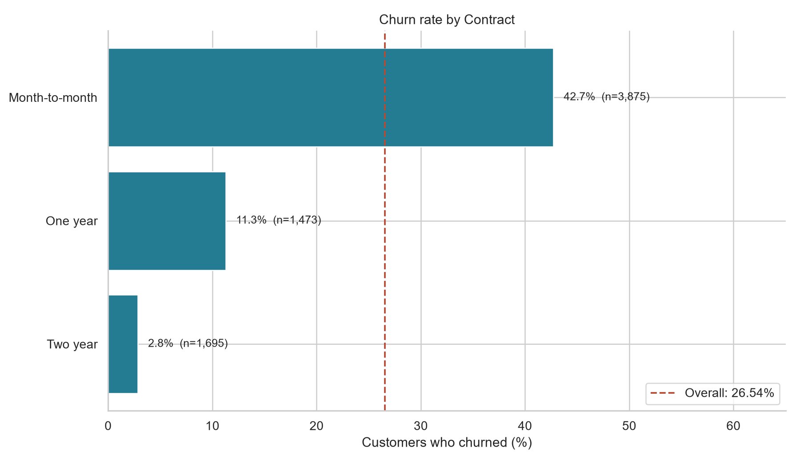
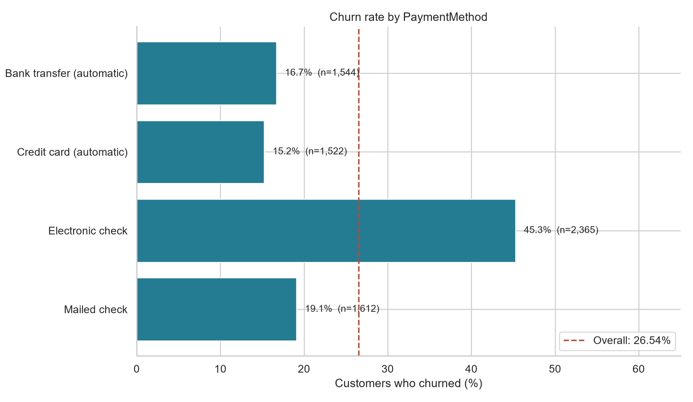
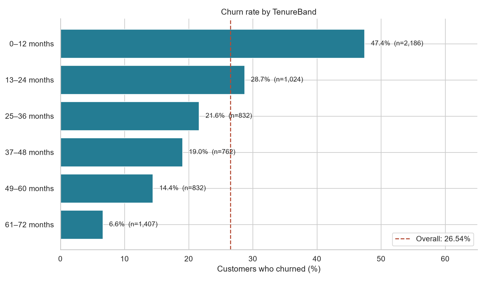
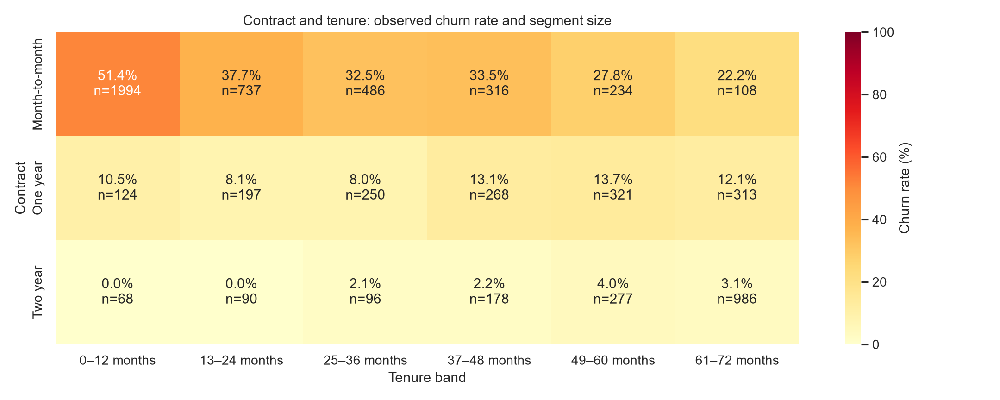

# Weekly EDA: churn across customer segments

Analyzed all 7,043 cleaned customer records. Overall churn: **1,869 / 7,043 = 26.54%**. Each rate uses that segment's customer count as its denominator; percentages are not shares of all churned customers.

## Findings

- Highest contract churn: **Month-to-month (42.71%)**.
- Highest payment-method churn: **Electronic check (45.29%)**.
- Highest tenure-band churn: **0–12 months (47.44%)**.

## Contract

| Segment | Customers | Churned | Churn rate | Difference vs overall |
|---|---:|---:|---:|---:|
| Month-to-month | 3,875 | 1,655 | 42.71% | +16.17 pp |
| One year | 1,473 | 166 | 11.27% | -15.27 pp |
| Two year | 1,695 | 48 | 2.83% | -23.71 pp |

## PaymentMethod

| Segment | Customers | Churned | Churn rate | Difference vs overall |
|---|---:|---:|---:|---:|
| Bank transfer (automatic) | 1,544 | 258 | 16.71% | -9.83 pp |
| Credit card (automatic) | 1,522 | 232 | 15.24% | -11.29 pp |
| Electronic check | 2,365 | 1,071 | 45.29% | +18.75 pp |
| Mailed check | 1,612 | 308 | 19.11% | -7.43 pp |

## TenureBand

| Segment | Customers | Churned | Churn rate | Difference vs overall |
|---|---:|---:|---:|---:|
| 0–12 months | 2,186 | 1,037 | 47.44% | +20.90 pp |
| 13–24 months | 1,024 | 294 | 28.71% | +2.17 pp |
| 25–36 months | 832 | 180 | 21.63% | -4.90 pp |
| 37–48 months | 762 | 145 | 19.03% | -7.51 pp |
| 49–60 months | 832 | 120 | 14.42% | -12.11 pp |
| 61–72 months | 1,407 | 93 | 6.61% | -19.93 pp |

## Contract and tenure together

The joint view helps distinguish tenure composition from contract associations. Always consider the displayed sample counts: rates in small cells are unstable. This is a descriptive cross-tab, not an adjusted causal estimate.

## Interpretation and retention opportunities

Prioritize investigation of onboarding experiences among short-tenure customers and service/value concerns among month-to-month customers. Review the electronic-check payment journey for friction. These are hypotheses for research and controlled retention experiments; the data does not establish that changing a contract or payment method will prevent churn. Contract, payment method, tenure, and service mix can be related.

## Method and limitations

- Tenure bands include both endpoints: 0–12, 13–24, 25–36, 37–48, 49–60, and 61–72 months. Zero-tenure customers remain in the first band. Values outside 0–72 or missing tenure stop the script rather than silently dropping records.
- Full-dataset EDA uses the cleaned readable export. The 11 imputed TotalCharges values do not enter these groupings or churn-rate calculations.
- This analysis includes the previously reserved test records for descriptive reporting. Do not use these findings to tune models and then describe that test set as untouched; reserve a fresh independent evaluation dataset if making model decisions from these findings.
- These are observed proportions in the supplied dataset, not future individual risk scores or a time series. No observation dates, direct complaint records, or detailed usage measurements are available. Generalization to a live customer population is unverified.
- Validation passed: all three breakdowns sum to 7,043 customers and 1,869 churners; independent SQLite queries reproduce every group count and rate. No records were filtered out.

## Reproduce and handoff

Run `python scripts/analyze_churn.py`. Tables and four PNG charts are written to `reports/eda/`. Run `sql/churn_eda.sql` after importing the cleaned CSV as `telco_customers`. CSV rates use percentage units (26.54 means 26.54%), so divide by 100 before using Power BI percentage formatting. See `power_bi_eda.md` for dashboard setup.
