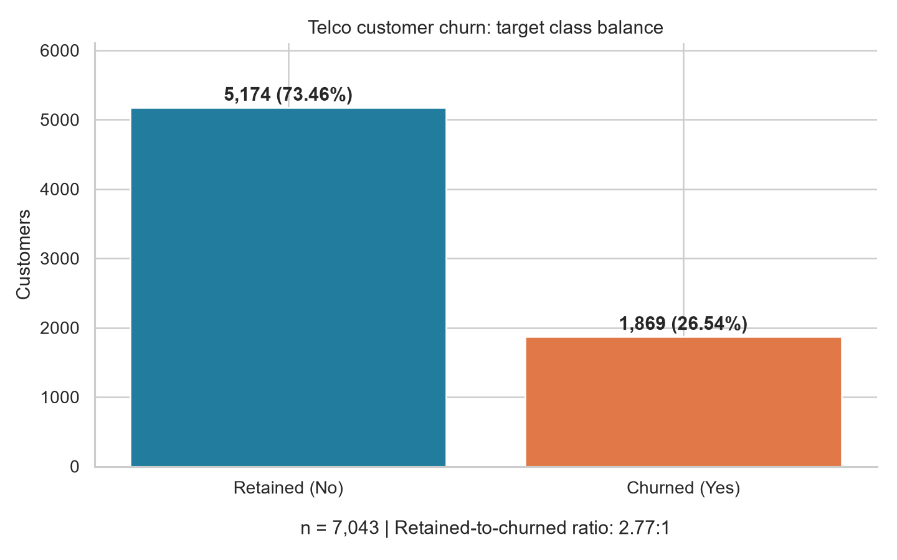

# Initial dataset inspection

Source: [Kaggle Telco Customer Churn](https://www.kaggle.com/datasets/blastchar/telco-customer-churn), downloaded directly through Kaggle's public dataset endpoint. The raw CSV is preserved; its SHA-256 is recorded in `provenance.json`.

## Shape and target balance

- **7,043 customers, 21 columns**: one identifier, 19 candidate predictors, one target (`Churn`).
- Retained (`No`): **5,174 (73.46%)**.
- Churned (`Yes`): **1,869 (26.54%)**.
- Majority/minority ratio: **2.77:1**, a moderate imbalance.
- Always predicting `No` gives **73.46% accuracy** and zero recall for churn. Accuracy alone is therefore misleading.

## Feature types

Three numeric predictors: `tenure`, `MonthlyCharges`, `TotalCharges`. The remaining 16 predictors are categorical, including integer-encoded `SeniorCitizen`. `customerID` is an identifier and must be excluded from model inputs. `Churn` is the binary categorical target.

| Feature | Inferred raw pandas dtype | Semantic type | Nulls after numeric conversion |
|---|---|---|---:|
| customerID | str | identifier | 0 |
| gender | str | categorical | 0 |
| SeniorCitizen | int64 | categorical | 0 |
| Partner | str | categorical | 0 |
| Dependents | str | categorical | 0 |
| tenure | int64 | numeric | 0 |
| PhoneService | str | categorical | 0 |
| MultipleLines | str | categorical | 0 |
| InternetService | str | categorical | 0 |
| OnlineSecurity | str | categorical | 0 |
| OnlineBackup | str | categorical | 0 |
| DeviceProtection | str | categorical | 0 |
| TechSupport | str | categorical | 0 |
| StreamingTV | str | categorical | 0 |
| StreamingMovies | str | categorical | 0 |
| Contract | str | categorical | 0 |
| PaperlessBilling | str | categorical | 0 |
| PaymentMethod | str | categorical | 0 |
| MonthlyCharges | float64 | numeric | 0 |
| TotalCharges | str | numeric | 11 |
| Churn | str | categorical | 0 |

See `feature_dictionary.csv` for categories, cardinality, blank counts, and preparation notes.

## Data quality

- Duplicate rows: **0**; duplicate customer IDs: **0**.
- Missing customer IDs: **0**; missing targets: **0**.
- `TotalCharges` contains **11 whitespace-only/missing values** and is initially read as text. All **11** missing-charge records have zero tenure. Nonblank unparseable values: **0**.
- The prepared export converts `TotalCharges` to numeric and preserves missing values. No rows were removed and no values were imputed. A zero-charge interpretation would require a business assumption; otherwise fit imputation on training data only.
- `No internet service` and `No phone service` are explicit categories, not missing data.

## Implications for the project

The data supports analysis of contract structure, payment method, tenure, charges, and service subscriptions. It contains **no direct complaint counts/text, call records, data-consumption measurements, or observation timestamps**. Service subscription indicators describe products held, not actual usage intensity. Complaint and detailed usage analysis requires another source. Without observation dates, a temporal validation or clearly defined future prediction window cannot be established from this file alone.

For subsequent modeling, use a reproducible stratified train/test split and stratified cross-validation. Fit preprocessing only on training folds. Compare class-weighted models against an unweighted baseline; any resampling must occur only inside training folds. Evaluate churn precision, recall, F1, average precision/PR curves, ROC-AUC, and confusion matrices. Choose an operating threshold using validation data and retention costs, then evaluate once on the held-out test set. Preserve the natural class distribution in evaluation and Power BI reporting.

## Handoff

`data/processed/telco_churn_typed.csv` is ready for import into Power BI or SQL staging. Set `customerID` to text, `tenure`/`SeniorCitizen` to whole numbers, and charges to decimal numbers; treat blank `TotalCharges` as null. No predictive model or dashboard is included in this acquisition-and-inspection task.
